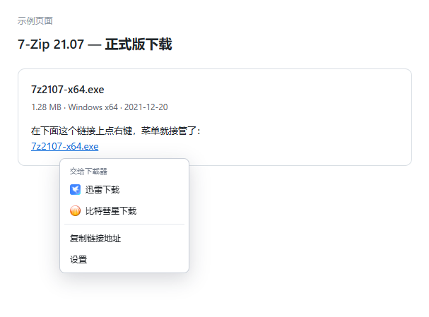

  
  <h1>下载路由 | DownloadRouter</h1>
  
接管浏览器任意下载链接，快速调起分发给迅雷 / 比特彗星等客户端 识别漏网就按住 <b>Alt</b> + 右键

  
Take over any download link in the browser, quickly launch and distribute it to clients such as Thunderbolt / BitComet.

  

    
    
    
  

  

    
    
  

---

## 链接

- [作者主页](https://mks155.github.io) — 查看作者其他脚本
- [GitHub 仓库](https://github.com/mks155/DownloadRouter) — 欢迎 [Star](https://github.com/mks155/DownloadRouter)，反馈请提 [Issue](https://github.com/mks155/DownloadRouter/issues)
- **[脚本猫 ScriptCat](https://scriptcat.org/zh-CN/script-show-page/8253)** — 首选推荐
- [Greasy Fork 安装页](https://greasyfork.org/zh-CN/scripts/598571-%E4%B8%8B%E8%BD%BD%E8%B7%AF%E7%94%B1-download-router)
- [OpenUserJS 安装页](https://openuserjs.org/scripts/mks155/%E4%B8%8B%E8%BD%BD%E8%B7%AF%E7%94%B1_Download_Router)

## 功能清单

- **右键即下**：在下载链接上右键，直接交给迅雷 / 比特彗星
- **自动识别**：按扩展名和 URL 特征判断是否为下载链接，普通链接不动
- **协议齐全**：HTTP / HTTPS / FTP / 磁力 / ED2K
- **识别兜底**：按住 <kbd>Alt</kbd> + 右键可跳过识别，对任意链接强制唤起
- **深浅色自适应**：默认跟随系统，也可在设置里锁定
- **零常驻侵入**：页面里不留任何常驻元素，右键菜单按需创建、用完即焚
- **严格 CSP 兼容**：样式走构造式样式表，不受页面 `style-src` 限制

## 效果

菜单只有下载器、复制链接和设置，浏览器自带的那些花里胡哨项全没了。

## 安装

1. 装一个脚本管理器，**首选 [脚本猫 ScriptCat](https://scriptcat.org/)**，也兼容 [Tampermonkey](https://www.tampermonkey.net/) 和 [Violentmonkey](https://violentmonkey.github.io/)
2. 从脚本猫安装页一键装，或手动导入本仓库的 `DownloadRouter.user.js`
3. 打开任意网页，右键一个下载链接

## 怎么设置

右键菜单最底部的 **设置**，或油猴菜单里的 **设置**：

| 选项 | 说明 |
|------|------|
| 唤起方式 | 两条触发路径，当前方式失效时切换另一个再试 |
| 菜单配色 | 跟随系统 / 强制浅色 / 强制深色 |
| Alt + 右键强制唤起 | 识别漏网时的兜底，默认开启 |

改完点 **保存** 即可，设置存在本机浏览器里。

## 使用小提示

- 磁力链、ED2K 属于系统全局协议，会交给系统里注册的默认 BT / 磁力客户端处理
- 浏览器首次唤起会弹「是否打开外部应用」，勾上记住选择即可
- 快捷键：<kbd>Alt</kbd> + 右键强制唤起，<kbd>Esc</kbd> 关闭菜单

## 点了没反应

1. 在设置里切换「唤起方式」再试，两条路径个别站点只认一条
2. 仍无反应 → 该协议没注册，即没有安装对应客户端，可在注册表确认：
   - `HKCU\SOFTWARE\Classes\thunder` → 迅雷
   - `HKCU\SOFTWARE\Classes\bc` → 比特彗星
3. Firefox 还需在 `about:config` 里设置
   `network.protocol-handler.expose.thunder` / `.bc` 为 `true`

## License

[MIT](https://github.com/mks155/DownloadRouter/blob/main/LICENSE) © 2026 [mks155](https://mks155.github.io)